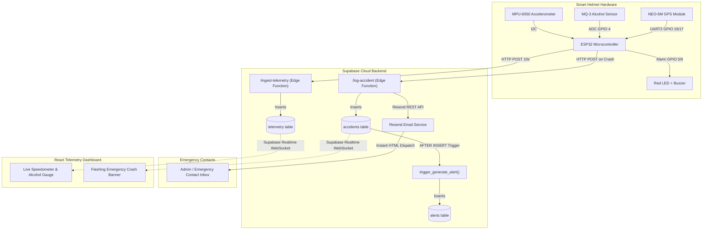

# 🛡️ Intelligent Helmet for Rider Safety (IoT + Cloud + AI Dashboard)

An end-to-end intelligent motorcycle helmet safety system powered by **ESP32**, **Supabase (PostgreSQL, Triggers, Realtime & Edge Functions)**, **Resend API**, and a modern **React + Vite + Tailwind CSS** telemetry dashboard.

---

## 🚀 System Architecture



---

## 📂 Project Structure

```
smarthelmet/
├── hardware/                  # ESP32 Firmware (PlatformIO / Arduino)
│   ├── platformio.ini         # PlatformIO environment & dependencies
│   ├── include/
│   │   ├── config.example.h   # Template configuration for GitHub
│   │   └── config.h           # Local secrets (Wi-Fi & Supabase) [gitignored]
│   └── src/
│       └── main.cpp           # Non-blocking sensor loop & crash detection
│
└── software/                  # Real-Time Web Application (React + Vite)
    ├── package.json           # Dependencies & scripts
    ├── vite.config.ts         # Vite bundler with Tailwind CSS v4
    ├── .env.example           # Template environment file for GitHub
    ├── .env                   # Local environment credentials [gitignored]
    ├── index.html             # Entry HTML with Inter & Outfit typography
    └── src/
        ├── App.tsx            # Main application layout & Realtime subscriptions
        ├── index.css          # Tailwind design system & animations
        ├── lib/
        │   └── supabase.ts    # Supabase JS client & TypeScript interfaces
        └── components/
            ├── Header.tsx             # System status & connectivity indicator
            ├── OnboardingForm.tsx     # Rider profile & helmet MAC pairing
            ├── TripControl.tsx        # Start/End trip controls & elapsed timer
            ├── Speedometer.tsx        # Analog SVG arc gauge & digital readout
            ├── AlcoholGauge.tsx       # MQ-3 alcohol meter with >3000 alarm
            ├── AccidentBanner.tsx     # Flashing emergency crash alert
            ├── TelemetryTable.tsx     # Live incoming packet stream table
            └── HardwareSimulator.tsx  # In-browser ESP32 payload test tool
```

---

## 🗄️ Database Schema (PostgreSQL)

- **`riders`**: `riderid` (PK), `name`, `contact`, `license`
- **`helmets`**: `helmetid` (PK), `mac_address` (UNIQUE)
- **`trips`**: `tripid` (PK), `riderid` (FK), `helmetid` (FK), `starttime`, `status` (`'ongoing' | 'ended'`), `safetyscore`
- **`telemetry`**: `id` (PK), `time`, `tripid` (FK), `speed`, `alcohollevel`
- **`accidents`**: `accidentid` (PK), `tripid` (FK), `location`, `severity`, `reporttime`
- **`alerts`**: `alertid` (PK), `accidentid` (FK), `message`, `alerttime`
- **Automatic Trigger**: `trg_accident_alert` fires on `accidents` INSERT and automatically formats:
  `'EMERGENCY: Impact detected for Trip #' || NEW.tripid || ' at ' || NEW.location || ' [Severity: ' || NEW.severity || ']'`

---

## ⚡ Quick Start

### 1. Web Dashboard (`software/`)

```bash
cd software
cp .env.example .env
# Edit .env with your Supabase credentials:
# VITE_SUPABASE_URL=https://<your-project>.supabase.co
# VITE_SUPABASE_ANON_KEY=<your-anon-key>

npm install
npm run dev
```

Open [http://localhost:5173](http://localhost:5173) in your browser.

### 2. ESP32 Firmware (`hardware/`)

1. Open `hardware/` in VS Code with the **PlatformIO** extension.
2. Copy `hardware/include/config.example.h` to `hardware/include/config.h`:
   ```cpp
   #define WIFI_SSID     "Your_WiFi_SSID"
   #define WIFI_PASSWORD "Your_WiFi_Password"
   #define SUPABASE_URL  "https://<your-project>.supabase.co"
   #define SUPABASE_ANON_KEY "<your-anon-key>"
   ```
3. Connect your ESP32 board and click **Upload** (or run `pio run --target upload`).

---

## 🔒 Security & Privacy

- All private credentials (`config.h`, `.env`) are excluded from Git via `.gitignore`.
- Template files (`config.example.h`, `.env.example`) are provided for zero-friction setup.
- Resend API keys are encrypted at rest using Supabase Edge Function Secrets.

---

## 📜 License

MIT License. Developed for Intelligent Rider Safety & IoT Telemetry Research.
